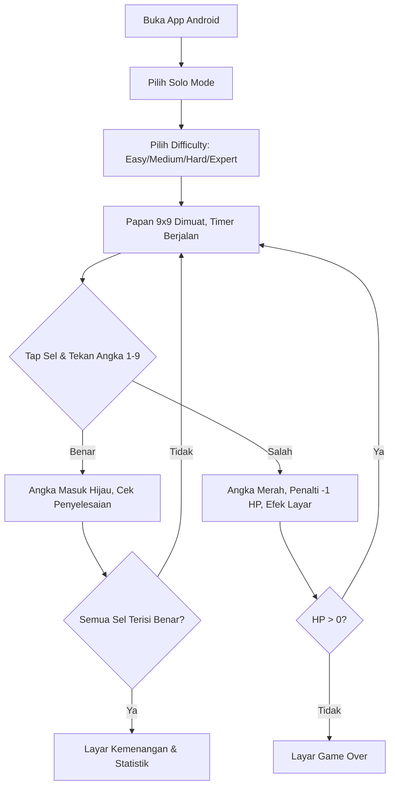
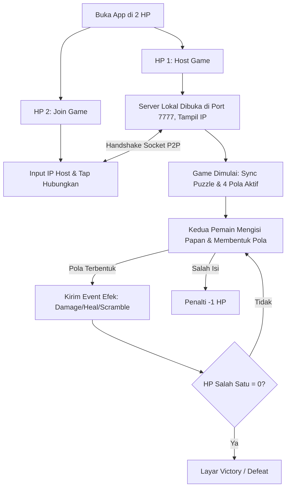
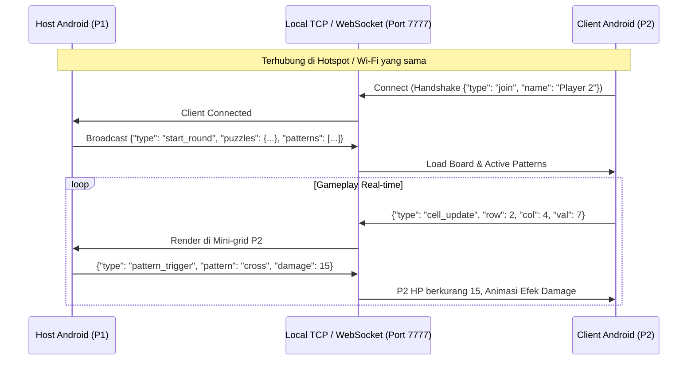
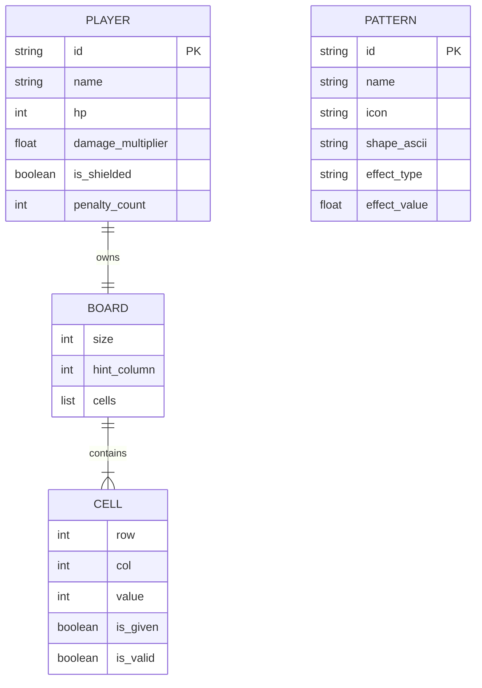

# PRD — Sudoku Battle: Android Mobile Edition (Offline LAN / Hotspot)

## 1. Overview
**Sudoku Battle: Android Mobile Edition** adalah game mobile Sudoku kompetitif berbasis Android yang dapat dimainkan secara **100% offline** baik secara **Solo** maupun **Multiplayer PvP** melalui koneksi jaringan lokal (**LAN / Wi-Fi Hotspot tethering**). Game ini menggabungkan logika klasik Sudoku 9×9 dengan elemen pertarungan real-time (HP System, Attack Patterns, Defense Buffs, Papan Scramble, dan Dynamic Hint Columns).

## 2. Goals & Success Metrics
- **Goal:** Menghadirkan game Sudoku mobile touch-friendly yang unik dan adiktif untuk dimainkan bersama teman secara offline tanpa memerlukan koneksi internet/server cloud.
- **Success Metrics:**
  - Game dapat dimainkan mulus di layar Android (touch input responsif, grid 9×9 proporsional, virtual number pad).
  - Dua perangkat Android dapat terhubung langsung via Wi-Fi Hotspot lokal (latency < 50ms, update papan lawan instan).
  - Mekanik serangan pola, penalti HP, scramble papan, dan bonus hint column terpicu secara akurat dan sinkron di kedua perangkat.

## 3. Requirements
- **Platform:** Android 7.0+ (API level 24+)
- **Networking:** Local TCP Socket / WebSocket Server di perangkat Host (Port default: `7777`), Client connect via Host IP pada subnet Hotspot yang sama (misal `192.168.43.1` atau subnet Wi-Fi lokal).
- **Offline Capability:** Tidak memerlukan login, akun, ataupun koneksi internet eksternal.
- **Form Factor & Orientasi:** Portrait (Vertical) optimal untuk smartphone layar 5" hingga 7".

## 4. Core Features

### 4.1 Touch UI & Kontrol Mobile
- **Interactive 9×9 Grid:** Navigasi berbasis tap langsung pada sel dengan highlight baris, kolom, dan sub-grid 3×3.
- **Virtual Numpad:** Tombol angka 1–9, tombol Hapus (Erase), tombol Notes/Pencil mode, dan tombol Hint.
- **Visual Status Bar:** HP Bar animasi bergradasi (Hijau > Kuning > Merah), indikator status Shield (🛡️), Multiplier (⚡), dan notifikasi banner.
- **Opponent Mini-Grid (PvP):** Tampilan mini-board lawan secara real-time di bagian atas layar agar pemain dapat memantau progres dan efek serangan secara langsung.

### 4.2 Mode Permainan
1. **Solo Mode:**
   - Pemilihan tingkat kesulitan (Easy, Medium, Hard, Expert).
   - Timer permainan & kuota 3 hint standar.
   - **Mekanik Penalti:** Salah memasukkan angka = **-1 HP**. Jika HP mencapai 0 = Game Over.
   - **Dynamic Hint Column:** Kolom acak menyala kuning setiap ~30 detik (aktif selama 15s) untuk hint gratis tanpa kuota.
2. **PvP Battle (Offline LAN / Hotspot):**
   - **Host Room:** Perangkat 1 menyalakan Hotspot (atau berada di Wi-Fi yang sama), membuka server lokal, dan menampilkan IP perangkat.
   - **Join Room:** Perangkat 2 memasukkan IP Host / Quick Connect untuk bergabung.
   - **HP Battle:** Masing-masing pemain memiliki **100 HP**. Ronde berakhir saat salah satu pemain menyelesaikan puzzle (+25 damage ke lawan) atau game berakhir saat HP lawan = 0.

### 4.3 Sistem 11 Pola Serangan (Battle Patterns)
Pola dideteksi secara otomatis dari sel-sel yang diisi oleh pemain (bukan angka preset/given):

| Icon | Pola | Bentuk Sel | Efek |
| :---: | :--- | :--- | :--- |
| ✚ | **Cross** | Plus (5 sel) | Serang lawan: **-15 HP** |
| ♥ | **Mini Heart** | Bentuk hati (6 sel) | Pulihkan diri: **+10 HP** |
| ⌐ | **L-Shape** | Huruf L (4 sel) | Serang lawan: **-10 HP** |
| ↗ | **Diagonal** | 3 sel diagonal | Buff: **Damage ×1.5** serangan berikutnya |
| 🛡 | **Box 2×2** | Kotak 2×2 (4 sel) | Aktifkan **Shield** (Blokir 1 serangan masuk) |
| ⚡ | **Zigzag** | 3 sel zigzag vertikal | Serang lawan: **-12 HP** |
| ➡ | **Row Streak** | 4 sel horizontal berurutan | Serang lawan: **-18 HP** (Heavy Attack) |
| ⬇ | **Col Streak** | 4 sel vertikal berurutan | Serang lawan: **-18 HP** (Heavy Attack) |
| 🗡 | **T-Shape** | Huruf T (4 sel) | Serang: **-12 HP** & Heal: **+5 HP** |
| ✖ | **X-Wing** | 4 sudut 3×3 | Serang lawan: **-20 HP** (Ultimate) |
| 🔀 | **Column Chaos** | 3 sel vertikal dalam 1 kolom | Serang: **-7 HP** + **Acak posisi angka di kolom papan lawan** |

## 5. Out of Scope
- Matchmaking online publik / server cloud internet.
- Iklan, pembayaran in-app, skin berbayar.
- Mode multiplayer lebih dari 2 pemain (>1v1).

## 6. User Flow

### Flow A: Solo Mode

### Flow B: PvP Offline LAN / Hotspot

## 7. Architecture & Network Protocol (P2P Socket)

## 8. Data Model & State Management

## 9. Design & Technical Constraints
- **UI Toolkit:** Flutter (Dart) / Modern Mobile Material 3 & Glassmorphism UI.
- **Responsiveness:** Tampilan harus otomatis menyesuaikan aspect ratio layar HP (16:9, 18:9, 19.5:9, 20:9).
- **Low Latency:** Menggunakan pesan binary/JSON berukuran sangat kecil (< 200 bytes per paket) untuk sinkronisasi seketika antar-HP.
- **Vibration & Haptics:** Feedback getar saat terkena damage, memicu pola, atau salah mengisi angka.

## 10. Assumptions & Decisions
- Perangkat Host dan Client terhubung pada jaringan lokal yang sama (satu HP membuka Portable Wi-Fi Hotspot, HP lain connect ke Wi-Fi tersebut, tanpa perlu kuota internet data).
- Port komunikasi default adalah `7777`.
